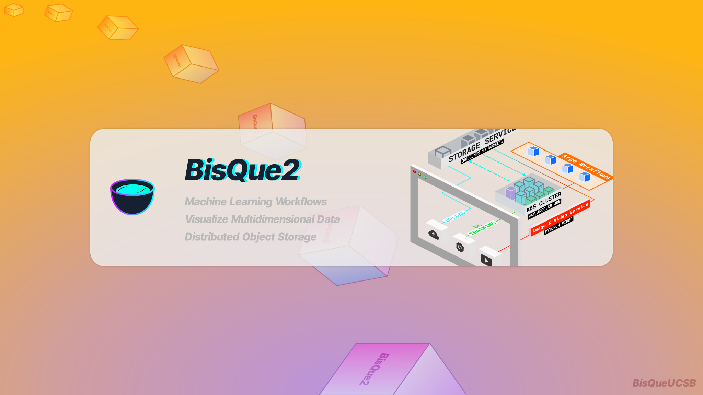

<p align="center">
  
</p>

**BisQue** is a web-based platform specifically designed to provide researchers with organizational and quantitative analysis tools for up to 5D image data. Users can extend BisQue by creating their own modules that take advantage of cutting edge machine learning algorithms. BisQue’s extensibility stems from two core concepts: flexible metadata facility and an open web-based architecture. Together these empower researchers to create, develop and share novel multimodal data analyses.

||  |
|----------------------------   |----------------------------------------------------------------------------|
|**Code**                       |  |
| **Continuous Integration**    | [](https://github.com/UCSB-VRL/bisqueUCSB/actions/workflows/docker-image.yml/badge.svg) |
| **Documentation**             | [](https://bisque.gitbook.io/docs/) |
| **Community**              | [](https://bisqueUCSB.github.io/contributing.html) [](https://community.bisque2.ece.ucsb.edu/) |

#### 🌟 User Feedback and Supported Environments
We are excited to share that BisQue is actively enabling cutting-edge research across a wide range of disciplines. Thanks to valuable feedback from our users, BisQue continues to support advancements in the following fields:

* **Biomedical Sciences:** Driving discoveries in health, disease mechanisms, and medical imaging.
* **Neuroscience:** Unlocking insights into brain function and neural networks.
* **Wildlife Conservation:** Enhancing the understanding of ecosystems and species monitoring.
* **Marine Science Research:** Supporting studies on ocean biodiversity and environmental changes.
* **Materials Science:** Facilitating breakthroughs in material characterization and development.

Keep in touch with the community by joining us on our discourse community platform [here](https://community.bisque2.ece.ucsb.edu/)

## 🚀 Getting Started

Welcome to BisQue! 🎉 Here's a quick glimpse of BisQue in action:


#### 💡 Features

✨ **Free and Open-Source:** No cost to explore and use.  
✨ **Flexible Annotations:** Supports both textual and graphical annotations.    
✨ **Cloud Scalability:** Manage PBs of images and millions of annotations effortlessly.   
✨ **Distributed Storage:** Compatible with local, iRODS, or S3 storage solutions.   
✨ **Integrated Image Analysis:** Perform high-throughput analysis powered by Condor.   
✨ **Language Support:** Analyze images in MATLAB, Python, or Java+ImageJ.   
✨ **Wide Format Compatibility:** Supports 100+ biological image formats.   
✨ **Large Image Processing:** Easily handle massive 5D images (100+ GB).   

Explore BisQue on our [web platform](https://bisque2.ece.ucsb.edu), and [request an account](https://docs.google.com/forms/d/e/1FAIpQLSfUCwOdl8Gd1KErPXbLWSPvF74ApT7M142sYQVdwluDUJXMAg/viewform) to sign in!

## ✅ Quick Setup

Start using **BisQue** locally with Docker by following these simple steps:

#### 🛠️ Method 1:  Using Prebuilt Docker Image

1. **Install Docker**  
   Ensure Docker is installed on your system, see installation instructions on [official website](https://docs.docker.com/engine/install/).

2. **Pull the Prebuilt Image**  
   Download the latest image from Docker Hub:
   ```bash
   docker pull amilworks/bisque-module-dev:git
3. **Run the BisQue Docker Container**  
   Start BisQue locally on port 8080:
   ```bash
   docker run --name bisque --rm -p 8080:8080 amilworks/bisque-module-dev:git
   ```
   Open your browser and navigate to http://localhost:8080. You should see a homepage similar to [BisQue Web](https://bisque2.ece.ucsb.edu).

   **Troubleshooting:** Ensure port 8080 is not occupied by another application.

#### 🛠️ Method 2:  Building the Docker Image locally

1. **Clone the Repository**
   ```bash
   git clone https://github.com/UCSB-VRL/bisqueUCSB.git
   cd bisqueUCSB
   ```

2. **Build the Docker Image**
   ```bash
   docker build --tag bisque-ucsb .
   ```
3. **Run the Docker Container**
   ```bash
   docker run --name bisque --rm -p 8080:8080 bisque-ucsb
   ```
Open your browser and go to http://localhost:8080.

## 💬 Need Help?
To further develop modules with BisQue or for queries, reach out to us on [Discourse](https://community.bisque2.ece.ucsb.edu/).

## 📰 Publications Featuring BisQue

* Jangid, Devendra K., Neal R. Brodnik, Amil Khan, Michael G. Goebel, McLean P. Echlin, Tresa M. Pollock, Samantha H. Daly, and B. S. Manjunath. __"3D Grain Shape Generation in Polycrystals Using Generative Adversarial Networks."__ Integrating Materials and Manufacturing Innovation (2022): 1-14.
*  Zhang, Angela, Amil Khan, Saisidharth Majeti, Judy Pham, Christopher Nguyen, Peter Tran, Vikram Iyer, Ashutosh Shelat, Jefferson Chen, and B S Manjunath. __“Automated Segmentation and Connectivity Analysis for Normal Pressure Hydrocephalus.”__ BME Frontiers 2022 (2022): 1–13.
* Latypov, Marat I., Amil Khan, Christian A. Lang, Kris Kvilekval, Andrew T. Polonsky, McLean P. Echlin, Irene J. Beyerlein, B. S. Manjunath, and Tresa M. Pollock. __"BisQue for 3D materials science in the cloud: microstructure–property linkages."__ Integrating Materials and Manufacturing Innovation 8, no. 1 (2019): 52-65.
* Polonsky, Andrew T., Christian A. Lang, Kristian G. Kvilekval, Marat I. Latypov, McLean P. Echlin, B. S. Manjunath, and Tresa M. Pollock. __"Three-dimensional analysis and reconstruction of additively manufactured materials in the cloud-based BisQue infrastructure."__ Integrating Materials and Manufacturing Innovation 8, no. 1 (2019): 37-51.
* Kvilekval K, Fedorov D, Obara B, Singh A, Manjunath BS. __Bisque: a platform for bioimage analysis and management__. Bioinformatics. 2010 Feb 15;26(4):544-52. doi: 10.1093/bioinformatics/btp699. Epub 2009 Dec 22. PMID: 20031971.

## 🌟 Acknowledgments
- Supported by NSF SI2-SSI Award No. 1664172, which funds the core BisQue software development infrastructure for sharing data and analysis modules.
- Supported by NSF MCB Grant No. 1715544.

[__License__](https://github.com/UCSB-VRL/bisqueUCSB/blob/master/source/LICENSE)
