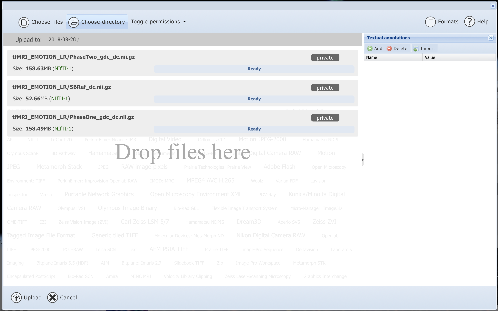
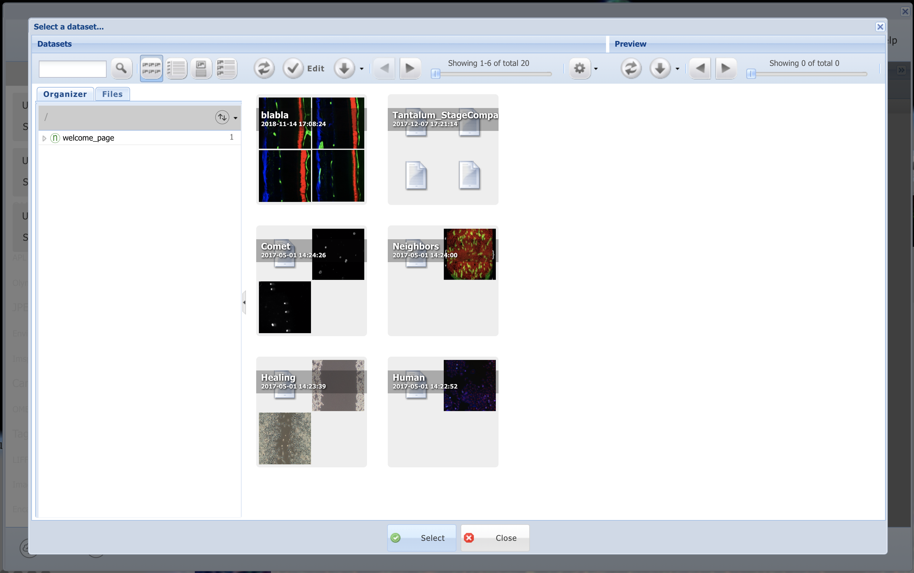
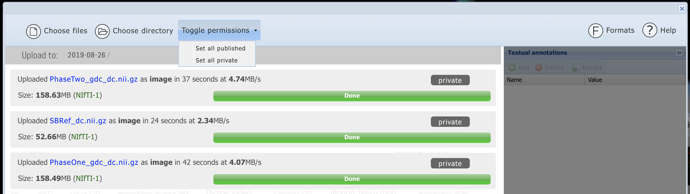
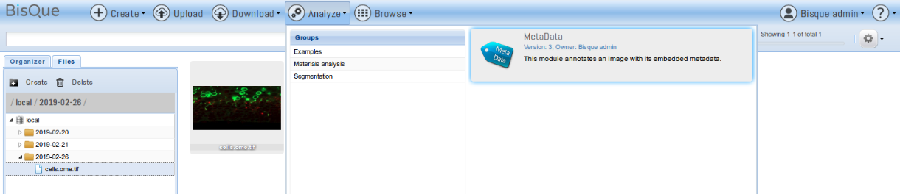
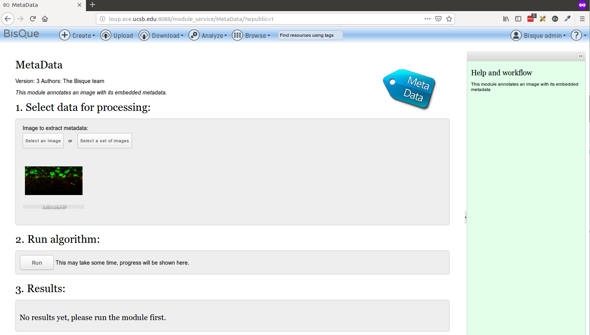

# BisQue Cloud Service {#intro} 


[BisQue](https://bisque.ece.ucsb.edu) is a web-based platform specifically designed to provide researchers with organizational and quantitative analysis tools for 5D image data. Users can extend Bisque with both data model and analysis extensions in order to adapt the system to local needs. Bisque's extensibility stems from two core concepts: flexible metadata facility and an open web-based architecture. Together these empower researchers to create, develop and share novel bioimage analyses.

Bisque is implemented as a scalable and modular web-service architecture. Image Servers store and manipulate images. Data servers provide flexible metadata storage. Execution servers house executable modules. The client-server architecture seamlessly integrates services across storage and processing hardware. Communication between various components is performed in a RESTful manner through HTTP requests carrying XML and JSON. Web clients use dynamic web components built with AJAX. Backends seamlessly provide access to local resources as well as large scalable resources like Amazon S3 or iRODS for data storage or Condor grids for computation.

## How to Login or Create a New User 


## How to Upload Data 


### Step 1. Login {-}

Make sure you are logged in. If you are logged in, the MENU bar will include __Upload__.

### Step 2. Upload File or Folder {-}

Click __Upload__ from the toolbar. There will be two options: __Choose File__ or __Choose Directory__.

### Step 3. Build a Dataset {-}

Selecting __Choose Directory__ will upload _all_ files in that directory. For example, we selected a folder with three NIFTI files.



Once the upload is finished, there will be two options to create a new dataset or add to an existing dataset.


<!--  -->

***

#### Add to New Dataset {-}

If we choose to __Add a New Dataset__, this means we will create a new dataset with these three files we uploaded. We can always add new data to this dataset later. 


#### Add to Existing Dataset {-}

If we choose __Add to Existing Dataset__, this means we will add these three NIFTI files to an existing dataset on BisQue. We are prompted with all of the datasets we have access to on BisQue: Datasets _we_ created and Datasets other _users_ have created but have made public.



***

### Step 4. Setting Permissions {-}

Once we have uploaded the data, we can set permissions for who can access our data. By default, everything is uploaded as __Private__. If we want to make our data publically available, we can __Toggle Permissions__.




## How to Add Annotations

### Overview {-}

Metadata plays a vital role in interpretation, querying, and analysis of images. For example, an experimental condition may highlight differences between images, image resolution may be needed to detect abnormally sized cells and experimenter comments may be handy in finding images of interest. There are many different types of metadata that may be associated with an image such as textual annotations, image-based object outlines and statistical distributions. In order to store the many types of annotations, we use __tagging__ or __hierarchical name–value pairs__. Flexible and hierarchical tagging is a key feature of Bisque that enables the user to rapidly model diverse experimental information.

***


## How to Run a Module 

__Running the MetaData Module__

The Metadata module is a very simple example that annotates an image with its embedded metadata. 

- Refresh the page, go to Analyze and select Metadata module there.
  

- Select a single image for test.
  

- Execute Run command and observe the updates in the results section
  
  
  
## ImageJ Module 

### Overview {-}

The ImageJ module allows users to execute arbitrary ImageJ macros on single images or datasets of images. Macro parameters can be changed and parameter value lists can be provided to experiment with parameter variations. The results are stored back in BisQue as Gobjects, tables, or images.

***

### Uploading of ImageJ Pipelines {-}

Most ImageJ macros can be uploaded and used directly with minor modifications. In order to upload a macro, click "Upload", select the macro file, and click "Upload". If the file extension is ".ijm", the file will automatically be recognized as a CellProfiler macro. 
 
As an example, we upload the CometAssay macro developed at the Microscopy Services Laboratory of the University of North Carolina at Chapel Hill, [Comet Assay](https://www.med.unc.edu/microscopy/resources/imagej-plugins-and-macros/comet-assay).
 

In order to verify the macro, it can be opened by browsing the `imagej_pipeline` resources and opening the recently uploaded macro. 

It will look like this:


 
Each box represents one ImageJ macro step and the arrows indicate the flow through the steps. Note that some boxes have different colors. For example, the "waitForUser" and "Dialog"-related boxes are shown in red to indicate that they are incompatible with BisQue and will render the macro non-executable. Green boxes indicate regular ImageJ steps that were kept unchanged. Blue boxes are BisQue specific steps (such as "load image from BisQue" or "store table to BisQue").
 
In order to execute the pipeline, we need to fix the red boxes and then re-upload the pipeline. In this example, the first red boxes correspond to the `waitForUser` steps of the macro:

```sh
waitForUser("Draw an oval around the comet head; Click OK");
run("Measure");
waitForUser("Draw an oval around the comet tail; Click OK");
run("Measure");
```
Since BisQue modules are currently not interactive, such steps are not allowed. However, since they request user-defined regions for head and tail of the comet to analyze, we can replace them with `BisQueLoadPolygon` steps:

```sh
BisQueLoadPolygon("head");
run("Measure");
BisQueLoadPolygon("tail");
run("Measure");
```

Each `BisQueLoadPolygon` step searches for a polygon Gobject in the current image and returns it as an ImageJ selection.
 
The other red boxes correspond to ImageJ "Dialog" functions:

```sh
Dialog.create("Do Another?");
Dialog.addCheckbox("Yes", true);
Dialog.show();
```

Again, since BisQue is not interactive, these are not allowed. In this example, these steps check if the user wants to analyze more comets. For simplicity, we will simply remove these steps and end the analysis after one iteration.
 
This addresses all red boxes but before being able to run the macro in BisQue, we need to add two important steps: the input and output. For the input, we can just add a new step at the very beginning:

```sh
BisQueLoadImage();
```

This will load the current image of the module execution into ImageJ for analysis. Note that for larger datasets of images, the macro will be executed once for each image.
 
For the output, we will store the comet analysis results as a table back into BisQue. This is achieved by adding the following line at the end of the macro:

```sh
BisQueSaveResults("comet stats");
```
This step will read the ImageJ results table and store it in BisQue under the given name. It will be linked in the output section of the current MEX (module execution) document.
 
The completed macro is now as follows:

```sh
BisQueLoadImage();
run("Set Measurements...", "centroid center integrated redirect=None decimal=3");
setFont("SansSerif", 18);
setColor(255, 255, 255);
BisQueLoadPolygon("head");
run("Measure");
BisQueLoadPolygon("tail");
run("Measure");
i = nResults -1;
tailx = getResult("XM", i);
headx = getResult("X", i-1);
taily = getResult("YM", i);
heady = getResult("Y", i-1);
tailden = getResult("RawIntDen",i);
headden = getResult("RawIntDen",i-1);
CometLen = sqrt( ((tailx-headx)* (tailx-headx)) + ((taily-heady)*(taily-heady)) );
setResult("TailLen",i,(CometLen));
setResult("TailMoment",i , (CometLen * tailden));
setResult("%TailDNA",i ,(tailden/(tailden + headden))*100);
updateResults();
BisQueSaveResults("comet stats");
```
 
After uploading this macro again, all boxes are either green or blue, indicating the pipeline is now valid for execution.

***

### Running an ImageJ Macro {-}

ImageJ macros can be run like any other BisQue module. First, select the macro to run (in this example, we select the CometAssay macro. After viewing the pipeline, click on "Analyze" and then on "ImageJ".
The ImageJ module page opens. Click "Select an Image" to choose a single image to run the macro on (alternatively, a dataset of images can be selected to run the macro on multiple images in parallel):
 


 
Note that the selected image(s) need to have at least two polygon Gobjects: one with semantic type "head" and one with semantic type "tail".
 
Finally, click the "Run" button to start the macro execution.
 
Once the execution finishes, the outputs are shown in section 4:
 


 
In this case, one table "comet stats" was generated. It contains the comet statistics computed in the macro. Depending on the macro, images or Gobjects can also be generated as output (see next section).
 
The generated tables can now be processed further in additional BisQue modules or shared with other users.

***

### Special BisQue extensions for ImageJ {-}

There are several BisQue-specific extensions to ImageJ to allow ImageJ macros to interact with the BisQue system. Each one is described in the following.
 
 
```sh
BisQueLoadImage()
```
This function corresponds to the `open()` function of ImageJ. Instead of opening an image from a file, however, it obtains the image from the BisQue module executor. The opened image is one of the images from the module input section.
 
 
```sh
BisQueLoadPolygon("gobject type")
```
This function loads a polygon Gobject from the current image into ImageJ as a selection for further processing in the macro. The "gobject type" parameter is used to select a specific Gobject with the semantic type "gobject type".
In other words, the current image has to have a Gobject as follows:

```sh
<gobject type="gobject type">
  <polygon>
    <vertex index="0" t="0.0" x="735.0" y="617.0" z="0.0"/>
    ...
    <vertex index="10" t="0.0" x="727.0" y="624.0" z="0.0"/>
  </polygon>
</gobject>
```
This can be generated for example via the graphical annotations tool in the BisQue image viewer.
 
 
```sh
BisQueSaveImage("image name")
```
This function corresponds to the `saveAs("Tiff", ...)` function of ImageJ. Instead of saving the image to a file, however, it stores the image back into BisQue as a new image resource. The created image is then referenced in the MEX (module execution) document's output section.
 
 
```sh
BisQueSaveROIs("polygon", "label", "color")
```
This function stores the current ImageJ ROIs as polygon Gobjects in the output section of the current MEX (module execution) document. Each polygon is assigned the provided label and color.
 
 
```sh
BisQueAddTag("tag_name", "tag_value")
```

This function adds a tag/value pair to the output section of the current MEX (module execution) document.
 
 
```sh
BisQueSaveResults()
```

This function stores the current ImageJ result table as a table resource in BisQue. The created table is then referenced in the MEX (module execution) document's output section.

## CellProfiler Module 


### Overview {-}

The CellProfiler module allows to execute arbitrary CellProfiler pipelines on single images or datasets of images. Pipeline parameters can be changed and parameter value lists can be provided to experiment with parameter variations. The results are stored back in BisQue as Gobjects, tables, or images.

***

### Uploading of CellProfiler Pipelines {-}

Most CellProfiler pipelines can be uploaded and used directly without modifications. In order to upload a pipeline, click __Upload__, select the pipeline file, and click __Upload__. If the file extension is `.cp` or `.cppipe`, the file will automatically be recognized as a CellProfiler pipeline. In order to verify the pipeline, it can be opened by browsing the `cellprofiler_pipeline` resources and opening the recently uploaded pipeline. It will look like this:
 

 
Each box represents one CellProfiler module and the arrows indicate the pipeline flow through the modules. Note that some boxes have different colors. For example, the first box (`BisQueLoadImages`) is shown in blue to indicate that the original module(s) from the pipeline have been replaced with a BisQue specific component that allows to read images directly from BisQue. These pipeline conversions happen automatically when the pipeline is uploaded into BisQue. The next three steps in the pipeline are shown in transparent color to indicate that they were inactivated. Certain operations (such as __Crop__ in this example) are not currently compatible with BisQue and are ignored without affecting the rest of the pipeline. Green boxes indicate regular CellProfiler modules that were kept unchanged. Red boxes indicate incompatible operations that could not be modified and will render the pipeline non-executable. The pipeline can be modified to replace the operations in red with other steps and the pipeline re-uploaded to fix this problem.

***

### Running a CellProfiler Pipeline {-}

In order to demonstrate how to run a CellProfiler pipeline, open the `ExampleFly.cppipe` pipeline that can be found in the public __Fly__ dataset inside the __CellProfiler Examples__ dataset (please ensure to check __Show public data__ in the options menu on the top right; otherwise, you will not see these resources):
 


 
After viewing the pipeline, click on __Analyze__ and then on __CellProfiler__:
 

 
The CellProfiler module page opens. Click __Select an Image__ to choose a single image to run the pipeline on (alternatively, a dataset of images can be selected to run the pipeline on multiple images in parallel):
 

 
For this example, we use the image `CPExample Fly1`. Note that the pipeline expects a three-channel image as input (this can be seen in the `BisQueLoadImages` step at the beginning of the pipeline). Next, modify any pipeline parameters if desired in section 2 (the values shown are the defaults found in the pipeline). Besides single parameters, this module also allows lists of parameters to be entered. For example, for __Size of smoothing filter__, one can enter $[10,20,30]$ to run the pipeline with all three smoothing filter settings in parallel. This allows to study the effect of this parameter on the final output.
 
Finally, click the __Run__ button to start the pipeline execution.

***

### Results {-}

Once the execution finishes, the pipeline outputs are shown in section 4:
 

 
In this case, one image and one table are generated. Additionally, Gobjects are created by a BisQue specific pipeline step `BisQueExtractGObjects` towards the end of the pipeline. This step reads certain columns from a generated table and interprets them as GObject parameters (in this case, ellipse coordinates and minor/major axis). The generated GObjects are stored as part of the Mex document, as with any other module. In order to view the Gobjects, open the input image (`CPExample Fly1`) again and under the __Graphical__ tab, check the top-most __CellProfiler__ line (representing the last module run). This displays three types of ellipses overlayed over the image, one for detected nuclei, one for the cell boundaries, and one for the detected locations of cytoplasm:
 


 
The GObjects were generated by the three `BisQueExtractGObjects` steps at the end of the pipeline, one for objects from the "Nuclei" table, one for objects from the "Cells" table, and one for objects from the __Cytoplasm__ table. The colors were set in these steps as red, green, and blue respectively. By hovering with the mouse pointer over any of the Gobjects, additional statistics are displayed.
 
The generated tables and Gobjects can now be processed further in additional BisQue modules or shared with other users.


## Plant Cell Segmentation

### Overview {-}

This module is for segmenting 3D membrane tagged cell images. The workflow is as follows: 3D UNet to output the probability map of a cell boundary, 3D watershed to get the initial cell label, and 3D Conditional Random Field (CRF) to refine the segmentation label. 

#### CellECT 2.0 Module Homepage {-}

Using the __Analyze__ tab on BisQue, you should see the Cell Segmentation 3D UNET module. Click on it and you should see a landing page like this.


#### Algorithm Workflow Diagram {-}

By using 3D UNET on the backend, we are able to segment the 3D volumes of the cells. We then create the segmentation map and use a Conditional Random Field (CRF) to further refine the segmentation map. Lastly, we use the information from the algorithm to extract features about the cells such as volume, surface coordinates, and many others.


#### Module Integration Workflow {-}

The module workflow consists of a source code folder with information on how to run the algorithm. We can then Dockerize the source code folder using a base image that includes the necessary CUDA libraries and dependencies and beginning testing whther the source code runs inside the container. Thereafter, we deploy the module on BisQue for public usage.


***

### __`Input`__ {-}


- `TIFF Image` with minimum $z > 1$ 

### Hyperparameters {-}


- `Threshold` - The bilateral standard deviation (threshold) for CRF define how much intensity-homogeneity is required within a region. Higher values allow greater variations under the same label.

- `Label Threshold` - The minimum possible volume of cells to avoid segmenting intercellular space as an individual cell.
- `Minimum Distance` -   In the seeds detection for watershed, the minimum possible distance between two seeds. The lower the value is, the more likely to have over-segmentation.

- `Minimum Cell Size` - Minimum size to be considered a cell

### Cell Features {-}
- `Cell Number` - The number of cells in each image stack.
- `Cell Volume` - The size of each cell in terms of number of voxels.
- `Cell Center` - The centroid of each cell.
- `Cell Coordinates` - The surface coordinate of each cell.
- `Adjacency Table` - The graph represents the neighbor of each cell 
- `3-way Conjunction Points` - The touch points of 3 neighboring cells 


### __`Output`__ {-}

- `Segmented TIFF Image`
- `HDF5 Table with Cell Features`


Table: (\#tab:unnamed-chunk-1)Sample HDF5 Table with Cell Features

 CellNumber   CellVolume  CellCenter   SegmentedImage            SurfaceCoordinates           
-----------  -----------  -----------  ------------------------  -----------------------------
          1         9832  [5, 57, 5]   SEGMENTED TIFF as ARRAY   ARRAY of Surface Coordinates 
          2         2387  [5, 87, 5]   SEGMENTED TIFF as ARRAY   ARRAY of Surface Coordinates 
          3          945  [5, 23, 5]   SEGMENTED TIFF as ARRAY   ARRAY of Surface Coordinates 
          4         2843  [5, 38, 5]   SEGMENTED TIFF as ARRAY   ARRAY of Surface Coordinates 
          5         1029  [5, 27, 5]   SEGMENTED TIFF as ARRAY   ARRAY of Surface Coordinates 

