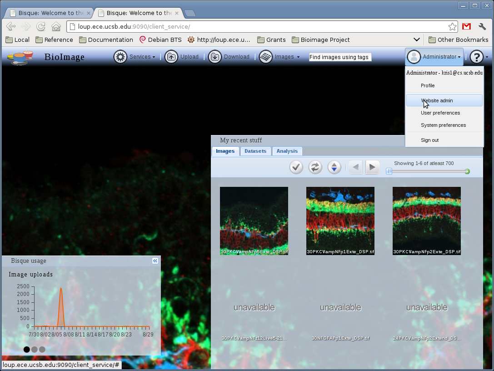

Bisque Administration
=====================

.. toctree::
   :maxdepth: 2

Online Administration
---------------------
The online adminstrator can be found under in user menu under ``WebSite Admin`` when logged
in as administrator.  There you can add or remove users or images and login as any user.

..   :height: 400px

From there several commands are available:

   *  Modify Users (Edit, Delete,  Login as).
   *  Create new Users.

``bq-admin`` Command Reference
------------------------------

Bisque installation and configuration is controlled with the ``bq-admin`` command

``setup``
     Setup a bisque server or engine
     ::
        bq-admin setup [server|engine].

``deploy``
     Prepare static files for deployment in a single directory.  This permits users planning
     on using a front end  web server to serve static content from services easily. Please see the wiki
     for detailed instructions on speical deployment options.

``database``
     database commands that modify and check the integrity of the bisque database

     Check the filestore for entries that do not exist in the database and optionally
     remove them.  These entries can occur when resources are removed.  By default,
     bisque will leave the binary files even though it deletes the metadata.
     ::
        bq-admin database clean

``module``
    Module commands for registration and removal of bisque modules
    ::
      bq-admin module register [-a] http://someengine.org/engine_service/module_name

``password``
    Password list, set, and convert utilities.  Convert a freetext database to use hashed. List
    all users and password. Set a user's password
    ::
      bq-admin password list
      bq-admin password set auser newpassword
      bq-admin password convert

``preferences``
    Initialize, read and/or update system config/preferences.xml.

    System preference allow the administrator to set certain user interface defaults.
    ::
      bq-admin preference init
      bq-admin preference read
      bq-admin preference save

``server``
    Start/stop bisque servers and engine
    ::
      bq-admin server start
      bq-admin server -v stop

