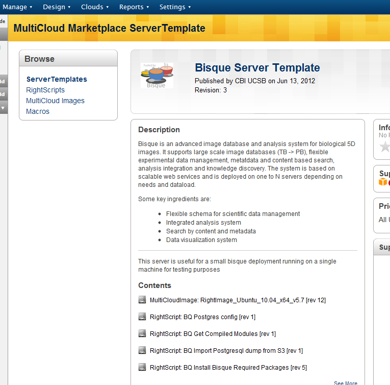
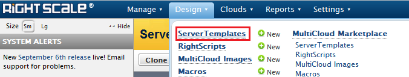
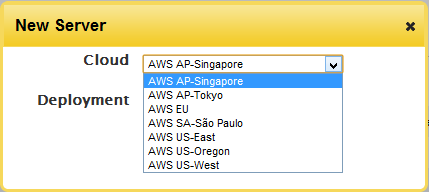
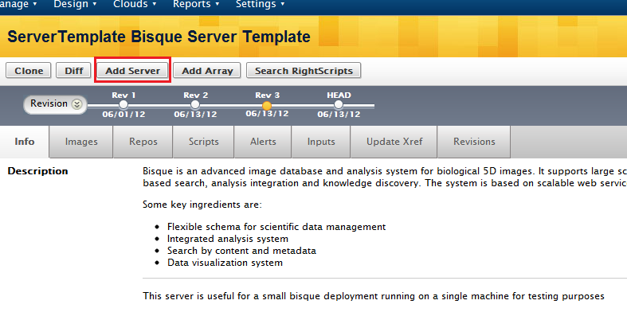
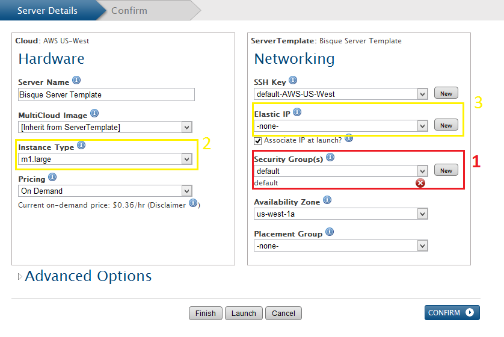
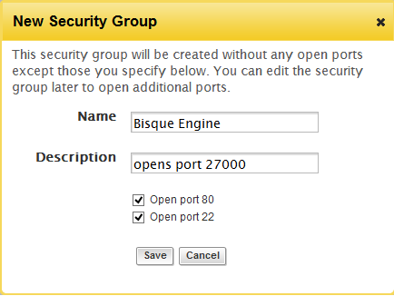
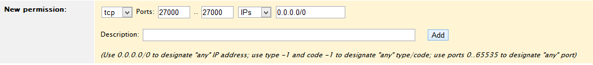
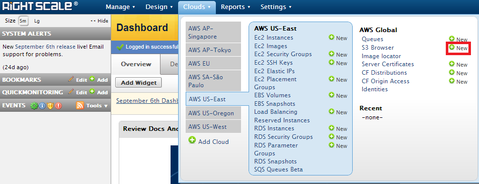
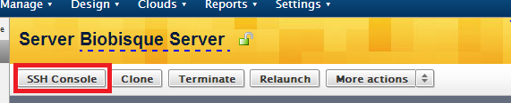

Bisque on the Cloud
===================
.. toctree::
   :maxdepth: 2

Overview
--------

It is possible to get a new Bisque instance up and running with minimal effort and technical know-how by using Amazon EC2 and Rightscale. This document guides you on how to setup a standalone bisque instance in the cloud and optionally configure a scalable condor grid for compute heavy instances.

Tutorials
---------

You need to Sign-up for `Amazon Web Services <http://aws.amazon.com>`_ and `Rightscale <https://www.rightscale.com>`_. 

- `Sign-up for Amazon Web Services <http://support.rightscale.com/03-Tutorials/01-RightScale/3._Upgrade_Your_Account/1.5_Sign-up_for_AWS>`_

- `Sign-up for a Free RightScale Account <http://support.rightscale.com/03-Tutorials/01-RightScale/1._Signing_Up_for_RightScale/Sign-up_for_a_Free_RightScale_Account>`_

- `Add AWS Credentials to RightScale <http://support.rightscale.com/03-Tutorials/01-RightScale/3._Upgrade_Your_Account/1.7_Add_AWS_Credentials_to_the_Dashboard>`_

Creating a Bisque Instance
--------------------------

- Logon to Rightscale and import the `Bisque Server Template <https://my.rightscale.com/library/server_templates/Bisque-Server-Template/lineage/15175>`_. The :ref:`fig_template` will serve as the basis for launching and configuring a new bisque installation.

.. _fig_template:

  bisque server template

- Once imported, the template will be available in your :ref:`fig_server_templates` . Select it and choose ":ref:`fig_add_server`". Also :ref:`fig_select_region` where you would like to host the new bisque installation. Typically a geographic region closest to where the installation would generally be accessed from would be best.

.. _fig_server_templates:

  server templates library

.. _fig_select_region:

  select the cloud region

.. _fig_add_server:

  Add Server

- Next, you will be presented with various options to customize the :ref:`fig_server_details` of your bisque installation. You may leave most options to default as shown with the exception of the security groups (1). It is very important to configure this option correctly otherwise, you may not be able to run any modules on the bisque instance.

.. _fig_server_details:

  hardware and network details

- In security groups, click on "new". You need to :ref:`fig_new_secgrp` that allows all TCP traffic from any IP on port '27000'.

.. _fig_new_secgrp:

  create a new security group

- Once created, select the cloud region of the bisque installation and click on EC2 security groups to :ref:`fig_edit_secgrp`. Select the group you created and :ref:`fig_add_permission` allowing TCP traffic on port 27000.

.. _fig_edit_secgrp:

.. figure:: images/edit_secgrp.png
  :align: center
  :alt: Edit a security group

  edit the security group

.. _fig_add_permission:

  add a permission

- For additional information regarding security groups - `How to create a security group using Rightscale <http://support.rightscale.com/12-Guides/Dashboard_Users_Guide/Clouds/AWS_Region/EC2_Security_Groups/Actions/Create_a_New_Security_Group>`_
- You may optionally edit the name of the server, the instance type (2) for a better machine (for a higher price) and also associate an elastic IP (3) i.e a static IP that can be used in case you wish to host your bisque instance with a more meaningful DNS name.
- Once configured, click launch. User inputs and Configuration options specific to the bisque system will be displayed next.

Configuring the Bisque Instance
-------------------------------

In order to configure the bisque instance, two S3 buckets need to be created for storing the image data and the database respectively.
To create an S3 bucket, select new in the :ref:`fig_new_s3`. Then, give a name for the S3 bucket, select the same cloud region as during the server configuration and :ref:`fig_create_bucket`.

.. _fig_new_s3:

  S3 browser

.. _fig_create_bucket:

.. figure:: images/create_bucket.png
  :align: center
  :alt: Create new S3 bucket

  create a new bucket

Remote access to your Bisque Instance
-------------------------------------

To :ref:`fig_ssh` , you may do so through the Rightscale interface easily. Just click "SSH Console" in the Server details.

.. _fig_ssh:

  ssh to your bisque instance
