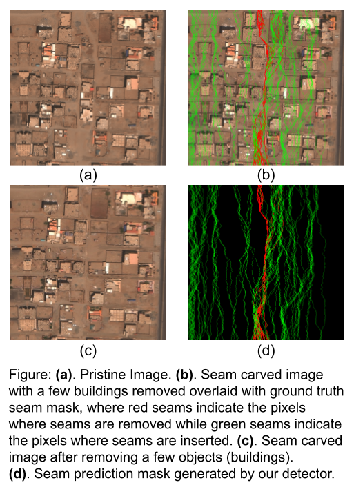

# Seam Carving Detector

Here is the forensic tool to flag images manipulated using technique a called Seam Carving. Seam carving can be used for object removal, object dislocation, and content-aware image retargeting.

## Input

.png or .jpeg image

## Output

.png image with overall image level manipulation score, in addition to, Seam Prediction mask indicating the regions of the image that are prone to seam removal (in red) and seam insertion (in green).

# Want to know more?

[Check out our paper here](https://openaccess.thecvf.com/content/CVPR2022W/WMF/papers/Gudavalli_SeeTheSeams_Localized_Detection_of_Seam_Carving_Based_Image_Forgery_in_CVPRW_2022_paper.pdf) to learn more about the methods and the datasets we used to build the seam carving detector.

